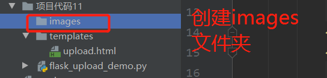
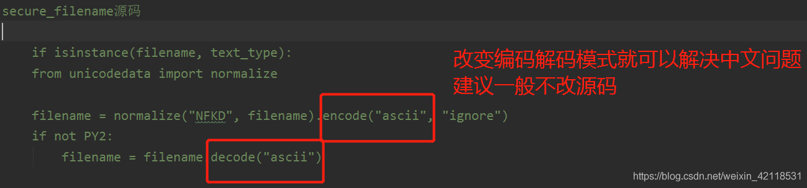

# Flask

---

- 简单实现

```python
from flask import Flask
# 实例化flask对象 __name__表示当前.py文件（当前模板）
app = Flask(__name__)

# 装饰器实现路由配置
@app.route('/')
def hello_world():
    return 'Hello World!'

if __name__ == '__main__':
    # 调用run方法，实现服务器的启动;调试模式
    app.run(debug=True)
```

### 配置文件

Flask项目的配置，都是通过app.config对象来进行配置的。比如要配置一个项目处于DEBUG模式下，那么可以使用app.config['DEBUG] = True来进行设置，那么Flask项目将以DEBUG模式运行。在Flask项目中，有四种方式进行项目的配置

```python
# 硬编码
app = Flask(__name__)
app.config['DEBUG'] = True

# update
"""
app.config是flask.config.Config的实例，而Config类继承自dict,因此通过update方法
"""
app.config.update(
	DEBUG = True,
    SECRET_KEY = '531313FESF'，
)

# 加载模块
"""
如果你的配置项特别多，你可以把所有的配置项都放在一个模块中，然后通过加载模块的方式进行配置，假设有一个settings.py模块，专门用来存储配置项的，此时你可以通过app.config.from_object()方法进行加载，并且该方法既可以接收模块的的字符串名称，也可以模块对象
"""
 - 1. 通过模块字符串
app.config.from_object('settings')
 - 2. 通过模块对象
import settings
app.config.from_object(settings)

# 加载文件
"""
该方法就是app.config.from_pyfile()，该方法传入一个文件名，通常是以.py结尾的文件，但也不限于只使用.py后缀的文件
"""
app.config.from_pyfile('settings.py',silent=True)
- silent=True 表示找不到加载文件时,静默，不需要提醒错误信息
```


### URL与视图

```python
URL与函数的映射
"""
从简单实现文件中，我们已经看到，一个URL要与执行函数进行映射，使用的是@app.route装饰器。@app.route装饰器中，可以指定URL的规则来进行更加详细的映射，比如现在要映射一个文章详情的URL，文章详情的URL是/article/id/，id有可能为1、2、3…,那么可以通过以下方式。
"""
from flask import Flask
import config
app = Flask(__name__)

@app.route("/list/<id>")
def article_list(id):
    return "这是第{}篇文章".format(id)

if __name__ == '__main__':
    app.config.from_pyfile('config.py')
    app.run()
"""
其中，尖括号是固定写法，语法为，variable默认的数据类型是字符串。如果需要指定类型，则要写成converter:variable，其中converter就是类型名称，可以有以下几种:
string: 默认的数据类型，接受没有任何斜杠/的字符串。
- int: 整形
- float: 浮点型。
- path： 和string类似，但是可以传递斜杠/。
- uuid： uuid类型的字符串。(永远不会重复的字符串)
- any：可以指定多种路径
"""

如果不想定制子路径来传递参数，也可以通过传统的?=的形式来传递参数，例如：/article?id=xxx，这种情况下，可以通过
request.args.get(‘id’)来获取id的值
如果是post方法，则可以通过request.form.get(‘id’)来进行获取


```

### 指定HTTP方法

```python
# 默认使用的是GET请求,可根据methods进行方法添加
@app.route('/login/',methods=['GET','POST'])
def login():
    return 'login'
```

### 页面的跳转和重定向

- **永久性重定向**：http的状态码是301，多用于旧网址被废弃了要转到一个新的网址确保用户的访问，最经典的就是京东网站，你输入www.jingdong.com的时候，会被重定向到www.jd.com，因为jingdong.com这个网址已经被废弃了，被改成jd.com，所以这种情况下应该用永久重定向。
- **暂时性重定向**：http的状态码是302，表示页面的暂时性跳转。比如访问一个需要权限的网址，如果当前用户没有登录，应该重定向到登录页面，这种情况下，应该用暂时性重定向。

**在flask中，重定向是通过flask.redirect(location,code=302)这个函数来实现的**，location表示需要重定向到的URL，应该配合之前讲的url_for()函数来使用，code表示采用哪个重定向，**默认是302也即暂时性重定向，可以修改成301来实现永久性重定向**.

```python
from flask import Flask, url_for, request, redirect

# 页面重定向   登录
@app.route("/sigin1/")             # 如果项目之后需要修改此url地址，硬编码方式需要修改的内容较多
def sigin():                       # 方法名一般不变   所以在url_for中可以使用这个参数进行重定向
    return "sigin——1"

@app.route("/profile/")
def profile():
    name = request.args.get("name")
    
    if name:
        return name
    else:
        # 重定向到登录页面
        # return redirect("/login_1/")      # 当登录的url地址需要修改时，此时这里的url也需要修改   这是硬编码方式
        return redirect(url_for("sigin"),code=301)       # 当使用url_for这个方法时候，登录的url改变，也不用改变这里参数了  
        # url_for传参的参数是方法名称，不是url地址名          code是网页响应的状态码   
```


### 请求响应（Response）

- Response对象。
- 字符串。其实Flask是根据返回的字符串类型，重新创建一个werkzeug.wrappers.Response对象，Response将该字符串作为主体，状态码为200，MIME类型为text/html，然后返回该Response对象。
- 元组。元组中格式是(response,status,headers)。response为一个字符串，status值是状态码，headers是一些响应头。
- 如果不是以上三种类型。那么Flask会通过Response.force_type(rv,request.environ)转换为一个请求对象。

```python
from flask import make_response

@app.route("/about/")             # 如果之后需要修改此url地址，
def about():
    # return "xxxxxxx"          # 可以返回字符串
    # return ['12312']          # 不能返回列表
 
    # return {'name': 'xxxx', 'age': "asd"}
    # return ('NAME', 'PYTHON')              # 元祖只能返回第一个值
    # return ('NAME', 'PYTHON')[1]           # 这样可以输出元祖第二个参数
    
    # The return type must be a string, dict, tuple, Response instance, or WSGI callable, but it was a list.
    # return (["PYTHON"], "JAVA")              # 相当于返回的是列表 报错

    # 相当于返回字符串
    # return Response("关于我们", status=200, mimetype="text/html")   # 相当于返回的是字符串
    # return "关于我们", 200                 # 与上面的返回结果相同        200 是状态码
    
    return make_response("关于我们")
```

- 可以使用make_response函数来创建Response对象，这个方法可以设置额外的数据，比如设置cookie，header信息。

```python
1.返回内容

from flask import make_response
 
@blue.route('/makeresponse/')
def make_response_function():
    response = make_response('<h2>羞羞哒</h2>')
    return response, 404
2.返回页面

from flask import make_response
 
@blue.route('/makeresponse/')
def make_response_function():
    temp = render_template('hello.html')
    response = make_response(temp)
    return response
>>>注意：make_response 想要返回页面，不能直接写做：make_response('hello.html')，必须用render_template('hello.html')形式。

3.返回状态码

>>>方式一：在make_response()中传入状态码

from flask import make_response
 
@blue.route('/makeresponse/')
def make_response_function():
    temp = render_template('hello.html')
    response = make_response(temp, 200)
    return response
>>>方式二：直接return状态码

from flask import make_response
 
@blue.route('/makeresponse/')
def make_response_function():
    temp = render_template('hello.html')
    response = make_response(temp)
    return response, 200

# 官方文档
- 可以传入一个字符串对象，它将被编码为UTF-8并被显示在body中
- 也可以传入一个字典类型的对象，它将被先变成json格式再返回
- 也可以传入一个元组，包含两个或者三个元素，分别是body内容，status状态码，headers响应头（字典类型）
```

### 模板

模板是一个web开发必备的模块。因为我们在渲染一个网页的时候，并不是只渲染一个纯文本字符串，而是需要渲染一个有富文本标签的页面。这时候我们就需要使用模板了。在Flask中，配套的模板是Jinja2，Jinja2的作者也是Flask的作者。执行效率高。以下对Jinja2简单介绍。

**Flask渲染Jinja模板**
要渲染一个模板，通过render_template方法即可，当访问url的时候，index()函数会在当前目录下的templates文件夹下寻找about.html模板文件。**如果想更改模板文件地址，应该在创建app的时候，给Flask传递一个关键字参数template_folder，指定具体的路径**。

```python
from flask import Flask, render_template


app = Flask(__name__, template_folder="./test")
# template_folder是自己设置的专属路径模板  建议写成绝对路径，而不是上面的相对路径


@app.route("/")
def index():
    # 默认会从templates文件夹目录下面找模板文件
    
    """
    因为render_template需要传递的是一个关键字参数，当你的模板中要传递的参数过多的时候，把所		有参数放在一个函数中显然不是一个好的选择，因此我们使用字典进行包装，并且加两个*号，来转换	成关键字参数。
    """
    context = {
        "username": "python",
        "age": 18,
    }
    
    return render_template('index.html', **context)     # **代表绑定关键字


if __name__ == '__main__':
    app.run(debug=True, port=8000)    # 端口修改一下  区分其他的代码文件中使用中的端口
```

**而index.html中应该这样写参数**

```html
<!DOCTYPE html>
<html lang="en">
<head>
    <meta charset="UTF-8">
    <title>测试网页</title>
</head>
<body>
    <h1>{{ username }}</h1>
    <h1>{{ age }}</h1>
    <h1>{{ age }}</h1>

</body>
</html>
<!--这里的 html文件 只能放在 templates 这个文件夹下-->
```

- 不同的数据类型模板传参

  ```html
  <!DOCTYPE html>
  <html lang="en">
  <head>
      <meta charset="UTF-8">
      <title>测试网页</title>
  </head>
  <body>
  	<!--字典嵌套取值-->
      <h1>{{books.Python}}</h1>
      <h1>{{ books['Python'] }}</h1>
      
  	<!--列表取值-->
      <h1>{{ book.1 }}</h1>
      <h1>{{ book[1] }}</h1>
  </body>
  </html>
  <!--这里的 html文件 只能放在 templates 这个文件夹下-->
  ```


### 类视图

之前我们接触的视图都是函数，所以一般简称视图函数。其实视图也可以基于类来实现，**类视图的好处是支持继承**，但是类视图不能跟函数视图一样，**写完类视图还需要通过app.add_url_rule(url_rule,view_func)来进行注册**。

- 标准类视图

标准类视图是继承自flask.views.View，并且在子类中必须实现dispatch_request方法，这个方法类似于视图函数，也要返回一个基于Response或者其子类的对象。

```python
from flask import Flask, render_template, url_for, request
from flask import views, jsonify

app = Flask(__name__)


@app.route("/")             # 实际相当于调用了add_url_rule()方法实现的
def view_demo():
    # 如果add_url_rule 给了endpoint，相当于给url起了一个名字，endpoint='name'
    print(url_for("name"))     # 这里的url_for("name")必须和endpoint='name'相同才能实现url反转的功能
    return "首页"

def profile():
    return "个人中心"

# 类视图   必须重写dispatch_request()方法
class ListView(views.View):         # 这里必须写views.View
    def dispatch_request(self):     # 必须重写dispatch_request()方法，否则会主动抛出异常  源码中：raise NotImplementedError()
        return "类视图"
    
    def demo(self):                  # self.demo()进行调用该方法
        return "测试"
# *********************************************************************************************************


# 返回json类型数据
class JsonView(views.View):
    def dispatch_request(self):
        response = self.get_response()          # 调用子类中重写的方法，将返回数据传入jsonify函数中
        return jsonify(response)                # jsonify(response)将数据返回成json数据类型
    
    def get_response(self):
        raise NotImplementedError()            # 主动抛出异常，代表在子类中必须要重写该方法


# 继承了类视图JsonView，就不用重写dispatch_request方法
class ListJsonView(JsonView):
    def get_response(self):
        return {'username': "xxxx"}           # 子类中重写了get_response方法，返回数据至调用方法的父类中

# *********************************************************************************************************


# 添加url规则
app.add_url_rule('/profile/', endpoint='name', view_func=profile)            # profile  注意不能加()
# 优先使用endpoint中命名的名称，然后再使用view_func命名的名称
app.add_url_rule('/list/', endpoint='list', view_func=ListView.as_view('list'))
app.add_url_rule('/listjson/', view_func=ListJsonView.as_view('listjson'))      # 注意类名   子类名


if __name__ == '__main__':
    app.run(debug=True)
```

#### add_url_rule注意事项：

**第一个’/login/'是URL地址 ，第二个as_view(‘login’)是方法名，通过url地址来执行as_view(‘login’)的方法。
且优先使用endpoint中命名的名称，然后再使用view_func命名的名称**

```python
# 第一个'/login/'是url地址    第二个as_view('login')是方法名
app.add_url_rule('/login/', endpoint='list', view_func=LoginView.as_view('login'))
```

**标准类视图另一个功能：把公有部分的数据抽离出来，放在父类中，由子类继承之后传递**

```python
from flask import Flask, render_template, url_for, request
from flask import views, jsonify

app = Flask(__name__)


# 返回公共的变量
class BaseView(views.View):
    def __init__(self):
        super().__init__()          # 调用父类中的方法
        
        self.context = {            # 把公有的数据抽离出来，放在父类中，由子类继承之后传递
            "name": "123"           # context传数据到html模板里，用name传
        }


class LoginView(BaseView):
    def dispatch_request(self):
        return render_template("login.html", **self.context)


# 返回公共的变量
class RegistView(BaseView):
    def dispatch_request(self):
        return render_template("regist.html", **self.context)

    
app.add_url_rule('/login/', view_func=LoginView.as_view('login'))
app.add_url_rule('/regist/', view_func=RegistView.as_view('regist'))         # 注意类名   子类名


if __name__ == '__main__':
    app.run(debug=True, port=8888)
```

### 基于调度方法的视图

Flask还为我们提供了另外一种类视图flask.views.MethodView，**对每个HTTP方法执行不同的函数（映射到对应方法的小写的同名方法上）**

```python
from flask import Flask, render_template, url_for, request
from flask import views
from flask.views import MethodView

app = Flask(__name__)


class LoginView(views.MethodView):
    # def rend_temp(self, *args, **kwargs):                   # 代码继续封装，将rend_template封装成单独的方法，方便调用
    #     return render_template('login.html',)
    
    def get(self, error=None):
        return render_template('login.html', error=error)         # 进行封装

    def post(self):
        name = request.form.get("name")
        password = request.form.get("password")
        
        # 此时这一步需要登录数据库，验证账号密码正确性
        if name == "123" and password == "123":
            return "登陆成功"
        else:
            # return "账号或者密码错误，登陆失败！"
            # return render_template("login.html", error="账号或者密码错误")     # 如果账号或者密码错误则传递一个参数error到模板文件login.html中
            return self.get("账号或者密码错误")                # 把上面的返回语句封装到get函数中


# 添加url规则   必须要有   第一个'/login/'是url地址    第二个as_view('login')是方法名
app.add_url_rule('/login/', view_func=LoginView.as_view('login'))


if __name__ == '__main__':
    app.run(debug=True, port=8888)
```

#### 1.3 权限验证

**用类视图的一个缺陷就是比较难用装饰器来装饰，比如有时候需要做权限验证的时候**

```python
# 登陆之后才能访问的装饰器
def login_required(func):
    def wrapper(*args, **kwargs):
        print(type(request.args))       # <class 'werkzeug.datastructures.ImmutableMultiDict'>
        print(type(request))            # <class 'werkzeug.local.LocalProxy'>

        username = request.args.get("username")       # 从url中获取username参数

        if username:
            return func(*args, **kwargs)             
            # 返回fun参数和不确定参数，如果方法wrapper中没写(*args, **kwargs)，这里也可以不用写，如果只是返回函数func,就相当于返回调用下面的seting()方法
        else:
            return "请先登录"
    return wrapper                             # 返回内层函数wrapper,(*args, **kwargs)是不确定参数


@app.route("/settings/")           # 装饰路由
@login_required                   # 装饰器   封装功能为了限制登录  顺序不能换
def seting():
    return "个人中心设置"
1234567891011121314151617181920
```

### **上面的双装饰器功能：

- return func(*args, **kwargs)
  返回fun函数和不确定参数，如果方法wrapper中没写(*args, **kwargs)，这里也可以不用写，如果只是返回函数func,就相当于返回调用下面的seting()方法
- @app.route("/settings/")
  装饰路由
- @login_required
  装饰器，封装功能为了限制登录 ，顺序不能与装饰路由换

**装饰器写完后，可以在类视图中定义一个属性叫做decorators，然后存储装饰器。以后每次调用这个类视图的时候，就会执行这个装饰器**

```python
class ProfileView(views.View):
    # 在类中用装饰器，需要用decorators属性
    decorators = [login_required]                 # 调用login_required方法当成装饰器
    
    def dispatch_request(self):
        return "个人中心"
    
app.add_url_rule('/proview/', view_func=ProfileView.as_view('proview'))
```

### 蓝图

跟静态资源文件一样，默认不设置任何模板文件的路径，将会在项目的templates中寻找模板文件。也可以设置其他的路径，在构造函数Blueprint中有一个template_folder参数可以设置模板的路径

```python
from flask import Blueprint, render_template

# url_prefix路由是从news/开始的    template_folder="test_template_mudel" 相对路径，相对于当前文件news.py来说，创建的文件要和news.py在同一路径
news_bp = Blueprint('news', __name__, url_prefix="/news/", template_folder="test_template_mudel")


# /news/   url_prefix   ----->   /news/
@news_bp.route("/")                   
def news():
    # return "新闻页面显示"

    # 查找模板文件会先根据 template_folder="test_template_mudel"这个路径去寻找，找不到之后再查找默认路径templates/news.html
    return render_template("news.html")
```

## url_for生成url：

用url_for生成蓝图的url，使用的格式是：蓝图名称+.+视图函数名称。比如要获取admin这个蓝图下的index视图函数的url。

```python
from flask import Flask, url_for
from blueprints.news import news_bp             # 导入news.py模块    news_bp相当于下面的app
from blueprints.books import book_bp

app = Flask(__name__)
app.register_blueprint(news_bp)                 # news_bp进行注册
app.register_blueprint(book_bp)                 # book_bp进行注册


@app.route("/")
def index():
    
    print(url_for("news.news"))          # 反转url   news.是根据Blueprint('news')中的第一个参数来确定的 后一个是写方法名
    print(url_for("books.book_detail", bid=5))  # 反转url   book_detail是方法名称   bid=5是book_detail方法中需要传的参数
    
    return "首页"


"""
反转url ： 第一个news.是根据Blueprint(‘news’)中的第一个参数来确定的，后一个news是写方法名。
反转url ： book_detail是方法名称，bid=5是book_detail方法中需要传的参数。
"""
if __name__ == '__main__':
    app.run(debug=True)
    
```

## 子域名

子域名在许多网站中都用到了，比如一个网站叫做xxx.com，那么我们可以定义一个子域名cms.xxx.com来作为cms管理系统的网址，**子域名的实现一般也是通过蓝图来实现**，我们创建蓝图的时候添加了一个url_prefix=/user作为url前缀，那样我们就可以通过/user/来访问user下的url。但使用子域名则不需要。另外，还需要配置SERVER_NAME。

比如app.config[SERVER_NAME]=‘example.com:9000’。并且在注册蓝图的时候，还需要添加一个subdomain的参数，这个参数就是子域名的名称。
**子域名cms.py实现**

```python
from flask import Blueprint

# subdomain="cms"是子域名名称
cms_bp = Blueprint("cms", __name__, subdomain="cms")


@cms_bp.route("/")
def cms_fun():
    return "子域名cms页面"
123456789
```

**主app.py实现**

```python
from flask import Flask, url_for
from blueprints.cms import cms_bp               # 导入cms.py文件中的cms_bp


app = Flask(__name__)
app.register_blueprint(cms_bp)

# https://cms.127.0.0.1:5000/      cms视图函数
# Mac系统   /etc/hosts
# Windows系统    C:\Windows\System32\drivers\etc\hosts文件  进行修改
# 127.0.0.1     ------->       host.com
# 127.0.0.1     ------->       cms.host.com
# flask中不支持 IP形式和localhost，例如：cms.127.0.0.1:5000    cms.localhost:5000
app.config['SERVER_NAME'] = 'host.com:8888' # 这个flask项目实现在host.com网页，端口为8888，设置这个'SERVER_NAME'之后之前的127.0.0.1本地网页就不能打开了


@app.route("/")
def index():    
    print(url_for("news.news"))          # 反转url   news.是根据Blueprint('news')中的第一个参数来确定的 后一个是写方法名
    print(url_for("books.book_detail", bid=5))  # 反转url   book_detail是方法名称   bid=5是book_detail方法中需要传的参数
    
    return "首页"


if __name__ == '__main__':
    app.run(debug=True)
```

### SQLAlchemy介绍和基本使用

**ORM介绍**
随着项目越来越大,采用原生SQL的方式在代码中会出现大量的SQL语句,对项目的进展非常不利：

- SQL语句重复利用率不高,越复杂的SQL语句条件越多,代码越长。会出现很多相近似的SQL语句
- 很多SQL语句是在业务逻辑中拼出来的,如果有数据库需要更改,就要去修改这些逻辑,很容易漏掉某些SQL语句的修改
- 写SQL时容易忽略web安全问题

**ORM: Object Relationship Mapping,对象关系映射**,通过ORM我们可以通过类的方式去操作数据库,而不用写原生的SQL语句。通过把表映射成类,把行作为实例,把字段作为属性,ORM在执行对象操作时候最终还是会把对应的操作转换为数据库原生语句。

**使用ORM的优点**：

- 易用性：使用ORM做数据库的开发可以有效的减少SQL语句,写出来的模型也更加直观；
- 性能损耗小；
- 设计灵活：可以轻松写出来复杂的查询；
- 可移植性：SQLAlchemy封装了底层的数据库实现,支持多个关系型数据库,包括MySQL,SQLite。

**实例整体代码flask_sqlalchemy_demo.py如下：**

```python
from flask import Flask
from flask_sqlalchemy import SQLAlchemy


# 127.0.0.1
HOSTNAME = "localhost"
DATABASE = "demo0425"
PORT = 3306
USERNAME = "root"
PASSWORD = "root"
DB_URL = 'mysql+mysqlconnector://{}:{}@{}:{}/{}'.format(USERNAME, PASSWORD, HOSTNAME, PORT, DATABASE)

app = Flask(__name__)

'''
# 创建引擎并生成Base类
engine = create_engine(DB_URL)
Base = declarative_base(engine)
'''
app.config['SQLALCHEMY_DATABASE_URI'] = DB_URL           # 数据库连接成功


# FSADeprecationWarning: SQLALCHEMY_TRACK_MODIFICATIONS adds significant overhead and will be disabled by default in the future.
# Set it to True or False to suppress this warning.'SQLALCHEMY_TRACK_MODIFICATIONS adds significant overhead and '
# 这里是为了解决上面的警告
app.config['SQLALCHEMY_TRACK_MODIFICATIONS'] = False

db = SQLAlchemy(app)               # 创建SQLAlchemy


class User(db.Model):
    __tablename__ = "user2"            # 如果没定义__tablename__，会默认以User模型的小写user定义表名
    
    id = db.Column(db.Integer, primary_key=True, autoincrement=True)
    name = db.Column(db.String(50))
    
    # articles = db.relationship('author')             # 下面使用backref='articles'，这里就不用定义了
    
    # 输出信息     __str__方法打印不够详细
    def __repr__(self):
        return "User(name:%s)" % self.name


class Article(db.Model):
    __tablename__ = "article2"
    
    id = db.Column(db.Integer, primary_key=True, autoincrement=True)
    title = db.Column(db.String(50))
    
    uid = db.Column(db.Integer, db.ForeignKey('user2.id'))    # 定义外键
    
    author = db.relationship('User', backref='articles')      # 反向引用articles属性


'''
Base.metadata.drop_all()
Base.metadata.create_all()         下面是替代简化语句
'''
db.drop_all()
db.create_all()

# 添加数据
user = User(name='U1')
article = Article(title='A1')
article.author = user    # 反向引用

db.session.add(article)         # 数据添加到数据库中
db.session.commit()

# articles = db.session.query(Article).order_by(Article.id).all()
# 查询数据
user = User.query.all()                     # 注意和之前的写法不一样，简化写法
print(user)
# users = db.session.query(User).all()      # 打印数据和上面相同，书写方式不一样

# 排序
users = User.query.order_by(User.id.desc()).all()
print(users)

# 删除数据
user = User.query.filter(User.name == 'U1').first()
db.session.delete(user)
db.session.commit()


@app.route("/")
def index():
    return "首页"


if __name__ == '__main__':
    app.run(debug=True)
```

## 2、Flask-Script 命令行传参

Flask-Script的作用是可以通过命令行的形式来操作Flask。例如通过命令跑一个开发版本的服务器、设置数据库，定时任务等。要使用Flask-Script，可以通过**pip install flask-script**安装最新版本。

```python
from flask_script import Manager
from flask_sqlalchemy_demo import app     # 需要将当前文件夹设置为当前根目录，才不会报错

manage = Manager(app)


@manage.command
def index():
    print("hello world")

 
'''
@option('-n', '--name', dest='name')
@option('-u', '--url', dest='url')
def hello(name, url):
    print("hello", name, url)
'''


# 命令行传参
@manage.option('-n', '--name', dest='name')
@manage.option('-u', '--url', dest='url')
def hello(name, url):
    print("hello", name, url)


if __name__ == '__main__':
    manage.run()
```

**flask_script_demo.py**

```python

from flask import Flask
from flask_sqlalchemy import SQLAlchemy
import config     # 导入config.py文件

app = Flask(__name__)
app.config.from_object(config)       # 加载配置文件中的选项

db = SQLAlchemy(app)


class AdminUser(db.Model):
    __tablename__ = "admin_users"  # 如果没定义__tablename__，会默认以User模型的小写adminuser定义表名
    
    id = db.Column(db.Integer, primary_key=True, autoincrement=True)
    name = db.Column(db.String(50))
    email = db.Column(db.String(50))
    
    # 输出信息     __str__方法打印不够详细
    def __repr__(self):
        return "User(name:%s)" % self.name


db.create_all()
db.session.commit()

```

**manage.py**

```python

from flask_script_demo import app, AdminUser, db      # 引用flask_script_demo.py中的app,AdminUser,db模块
from flask_script import Manager

manage = Manager(app)


'''
@option('-n', '--name', dest='name')
@option('-u', '--url', dest='url')
def hello(name, url):
    print("hello", name, url)
'''


# 命令行传参
@manage.option('-n', '--name', dest='name')
@manage.option('-e', '--email', dest='email')
def add_user(name, email):
    user = AdminUser(name=name, email=email)         # 前面的name=是字段，后面的name是参数值
    
    db.session.add(user)
    db.session.commit()
    

if __name__ == '__main__':
    manage.run()

12345678910111213141516171819202122232425262728293031323334
```

#### 定义命令的三种方法

1. **使用@command装饰器**
2. **使用类继承自Command类**

```python
from flask_script import Command,Manager
from your_app import app

manager = Manager(app)

class Hello(Command):
    "prints hello world"

    def run(self):
        print("hello world")

manager.add_command('hello',Hello())
123456789101112
```

使用类的方式，有三点需要注意：

- 必须继承自Command基类。
- 必须实现run方法。
- 必须通过add_command方法添加命令。

1. **使用option装饰器**：如果想要在使用命令的时候还传递参数进去，那么使用@option装饰器更加的方便

```python
@manager.option('-n','--name',dest='name')
def hello(name):
    print('hello ',name)
123
```

调用hello命令

```shell
python manage.py -n xxx
python manage.py --name xxx
12
```

#### 添加参数到命令中

- option装饰器：以上三种创建命令的方式都可以添加参数

```python
@manager.option('-n', '--name', dest='name', default='joe')
@manager.option('-u', '--url', dest='url', default=None) 
def hello(name, url): 
  if url is None: 
     print("hello", name)
  else: 
      print("hello", name, "from", url)
1234567
```

- command装饰器：command装饰器也可以添加参数，但是不能那么的灵活

```python
@manager.command 
def hello(name="Fred") 
  print("hello", name)
123
```

- 类继承：类继承也可以添加参数

```python
from flask_Flask import Comman,Manager,Option

class Hello(Command):
  option_list = (
      Option('--name','-n',dest='name'),
  )

  def run(self,name):
      print("hello %s" % name)
123456789
```

如果要在指定参数的时候，动态的做一些事情，可以使用get_options方法:

```python
class Hello(Command):
  def __init__(self,default_name='Joe'):
self.default_name = default_name

  def get_options(self):
      return [
          Option('-n','--name',dest='name',default=self.default_name),
      ]

  def run(self,name):
      print('hello',name)
1234567891011
```

## Flask-Migrate

在实际的开发环境中，经常会发生数据库修改的行为。**一般我们修改数据库不会直接手动的去修改，而是去修改ORM对应的模型，然后再把模型映射到数据库中**。这时候如果有一个工具能专门做这种事情，就显得非常有用了，而flask-migrate就是做这个事情的。**flask-migrate是基于Alembic进行的一个封装，并集成到Flask中，而所有的迁移操作其实都是Alembic做的，他能跟踪模型的变化，并将变化映射到数据库中**。

要让Flask-Migrate能够管理app中的数据库，需要使用Migrate(app,db)来绑定app和数据库

```python
from flask import Flask
from flask_sqlalchemy import SQLAlchemy
from constants import DB_URI
from flask_migrate import Migrate

app = Flask(__name__)
app.config['SQLALCHEMY_DATABASE_URI'] = DB_URI
app.config['SQLALCHEMY_TRACK_MODIFICATIONS'] = True
db = SQLAlchemy(app)
# 绑定app和数据库
migrate = Migrate(app,db)

class User(db.Model):
    id = db.Column(db.Integer,primary_key=True)
    username = db.Column(db.String(20))

    addresses = db.relationship('Address',backref='user')

class Address(db.Model):
    id = db.Column(db.Integer,primary_key=True)
    email_address = db.Column(db.String(50))
    user_id = db.Column(db.Integer,db.ForeignKey('user.id'))

db.create_all()

@app.route('/')
def hello_world():
    return 'Hello World!'

if __name__ == '__main__':
    app.run()
```

**实例代码文件如下**：

**正常我们使用flask-migrate时，步骤是**：1、主文件flask_app.py

```python

from flask import Flask
from flask_sqlalchemy import SQLAlchemy
import config                             # 引用config文件
from model import User                    # 引用model中的User类

from exts import db                      # 解决互相引用的问题,用exts.py当做第三方文件来引用

'''
ImportError: cannot import name 'User'     互相引用报错

需要用第三个文件来间接导入
'''
app = Flask(__name__)

app.config.from_object(config)

# 需要解决互相引用的问题 传app参数到db中
db.init_app(app)

# db = SQLAlchemy(app)   # 互相引用的问题导致不能直接传参到db


'''
name = db.Column(db.String(50))
email = db.Column(db.String(50))
password = db.Column(db.String(50))
'''
# user = User(name='x1', email='123@cc.com', password='123')
# db.session.add(user)
# db.session.commit()


@app.route("/")
def index():
    return "首页"


if __name__ == '__main__':
    app.run()
```

2、模型文件model.py

```python

# 这个model.py文件放app的模型

# from flask_app import db

# 解决互相引用的问题，用exts.py当做第三方文件来引用
from exts import db


class User(db.Model):
    __tablename__ = "user_migrate"
    
    id = db.Column(db.Integer, primary_key=True, autoincrement=True)
    name = db.Column(db.String(50))
    email = db.Column(db.String(50))
    password = db.Column(db.String(50))
    
    # migrate测试添加字段
    age = db.Column(db.Integer)
    gender = db.Column(db.Enum('1', '2'))
    
    # 输出信息     __str__方法打印不够详细
    def __repr__(self):
        return "User(name:%s)" % self.name
```

**3、映射数据库文件manage.py**

manage.py文件
这个文件用来存放映射数据库的命令，MigrateCommand是flask-migrate集成的一个命令，因此想要添加到脚本命令中，需要采用manager.add_command(‘db’,MigrateCommand)的方式，以后运行python manage.py db xxx的命令，其实就是执行MigrateCommand。

```python

# 通过这个文件去映射数据库
# 写法固定
from flask_script import Manager
from flask_migrate import Migrate, MigrateCommand
from exts import db                    # exts是为了解决循环引用，根据自己建立的py文件名称修改
from flask_app import app

# 映射哪个模型，就导入哪个模型
from model import User                # 这个部分会在不同项目中不一样

manage = Manager(app)

# init  migrate upgrade
# 模型 -> 迁移文件 -> 表
# 1.要使用flask_migrate,必须绑定app和DB
Migrate(app, db)
# 2.把migrateCommand命令添加到manager中。
manage.add_command('db', MigrateCommand)

if __name__ == '__main__':
    manage.run()


```

**4、配置文件config.py**

```python

# 这里写的是flask_app.py配置选项，固定写法，方便导入其他的模块

# 127.0.0.1
HOSTNAME = "localhost"
DATABASE = "demo0429"
PORT = 3306
USERNAME = "root"
PASSWORD = "root"
DB_URL = 'mysql+mysqlconnector://{}:{}@{}:{}/{}'.format(USERNAME, PASSWORD, HOSTNAME, PORT, DATABASE)

'''
# 创建引擎并生成Base类
engine = create_engine(DB_URL)
Base = declarative_base(engine)
'''
SQLALCHEMY_DATABASE_URI = DB_URL           # 数据库连接成功

# FSADeprecationWarning: SQLALCHEMY_TRACK_MODIFICATIONS adds significant overhead and will be disabled by default in the future.
# Set it to True or False to suppress this warning.'SQLALCHEMY_TRACK_MODIFICATIONS adds significant overhead and '
# 这里是为了解决上面的警告
SQLALCHEMY_TRACK_MODIFICATIONS = False

```

**5、exts是为了解决循环引用问题**

```python

# 这个文件是充当第三方引用文件的作用
# exts是为了解决循环引用
from flask_sqlalchemy import SQLAlchemy

'''
# 需要解决互相引用的问题 传app参数db中
db.init_app(app)
'''
# 这里没有导入app参数 ，在flask_app.py中传app参数到db中
db = SQLAlchemy()

```

初始化一个迁移文件夹**

```powershell
python manage.py db init     每个项目执行一次 他负责生成迁移包  #初始化，工程目录下生成一个migrations文件夹

python manage.py db migrate  生成迁移文件
python manage.py db upgrade  执行上升操作(执行迁移信息)  相当于之前的creat_all()操作
```

## WTForms表单验证

**Flask-WTF**
Flask-WTF是简化了WTForms操作的一个第三方库。WTForms表单的两个主要功能是验证用户提交数据的合法性以及渲染模板。当然还包括一些其他的功能：CSRF保护，文件上传等。安装Flask-WTF默认也会安装WTForms，因此使用以下命令来安装Flask-WTF。

**程序主文件demo.py**

```python

from flask import Flask, request, render_template
from forms import RegistForm   # 设置为根目录之后，导入forms.py中的RegistForm进行表单验证


app = Flask(__name__)


@app.route("/")
def index():
    return "123"


# 接受GET请求
@app.route("/regist/", methods=['GET', 'POST'])
def regist():
    if request.method == 'GET':
        return render_template('regist.html')
    else:
    	# 采用wtforms模块进行表单验证
        form = RegistForm(request.form)   # 将forms.py中的验证信息都传入form中
        if form.validate():
            return "success"
        else:
            # 验证错误信息
            print(form.errors)
            
            return "fail"
        
        # 表单验证
        # username = request.form.get('username')
        # password = request.form.get('password')
        # password_repate = request.form.get('password_repate')
        #
        # if len(username) > 3 or len(username) < 10:
        #     return "用户名长度不正确"
        #
        # if password != password_repate:
        #     return "密码不一致"
        #
        # if len(password) > 3 or len(password) < 10:
        #     return "密码长度不正确"


if __name__ == '__main__':
    app.run(debug=True)

```

**网页界面：regist.html文件**

```html
<!DOCTYPE html>
<html lang="en">
<head>
    <meta charset="UTF-8">
    <title>Title</title>
</head>
<body>
<!--   form验证表单     -->
<form action="" method="post">
<!--表单提交到Flask的名字    <br>换行-->
    用户名:<input type="text" name="username"><br>
    密码： <input type="text" name="password"><br>
    确认密码： <input type="text" name="password_repate"><br>
    <input type="submit" value="注册">
</form>

</body>
</html>
123456789101112131415161718
```

**forms.py表单验证**

```python

from wtforms import Form, StringField, validators
from wtforms.validators import Length, Regexp, EqualTo
# Regexp 正则表达式模块
# wtforms.validators包含很多内置验证器
# EqualTo 验证器：密码不一致
'''
表单验证

username = request.form.get('username')
password = request.form.get('password')
password_repate = request.form.get('password_repate')

if len(username) > 3 or len(username) < 10:
    return "用户名长度不正确"

if password != password_repate:
    return "密码不一致"

if len(password) > 3 or len(password) < 10:
    return "密码长度不正确"

'''

# 表单验证采用wtforms模块


class RegistForm(Form):
    # 实现判断username的长度验证3-10
    username = StringField(validators=[Length(min=3, max=10, message="用户名长度不正确")])
    
    # 判断password的长度验证3-10
    password = StringField(validators=[Length(min=3, max=10)])

    # 判断 password_repate 的长度验证3-10   EqualTo("password")验证password_repate是否一致
    password_repate = StringField(validators=[Length(min=3, max=10), EqualTo("password", message="两次密码不一致
```

## 文件上传

1. 在模版中，form表单中，需要指定encotype='multipart/form-data’才能上传文件。
2. 在后台如果想要获取上传的文件，那么应该使用request.files.get(‘avatar’)来获取。
3. 保存文件之前，先要使用werkzeug.utils.secure_filename来对上传上来的文件名进行一个过滤。这样才能保证不会有安全问题。
4. 获取到上传上来的文件后，使用avatar.save(路径)方法来保存文件。、
5. 从服务器上读取文件，应该定义一个url与视图函数，来获取指定的文件。在这个视图函数中，使用send_from_directory(文件的目录,文件名)来获取。

**程序主文件flask_upload_demo.py**

```python

from flask import Flask, render_template, request
import os                    # 导入文件地址模块

app = Flask(__name__)
upload_path = os.path.join(os.path.dirname(__file__), 'images')
print(upload_path)   # 'images'文件的绝对路径


@app.route('/')
def index():
    return '123'
    
    
@app.route("/upload/", methods=['GET', 'POST'])
def upload():
    # return render_template('upload.html')
    if request.method == 'GET':                  # get请求用request.args.get()接收
        return render_template('upload.html')
    else:
        desc = request.form.get('desc')                # post请求用request.form.get()接收
        image_file = request.files.get('image_file')   # request.files.get()接收文件类型
        # image_file.filename 保存文件的名字 对应html中的name="image_file"     'images'保存的文件夹名称
        image_file.save(os.path.join('images', image_file.filename))  # os.path.join('images', image_file.filename)是两个参数在join()中
        print(os.path.join('images'))      # 'images'文件的路径
        return '文件上传成功'
     
    
if __name__ == '__main__':
    app.run(debug=True)

```

**upload.html文件**

```python
<!DOCTYPE html>
<html lang="en">
<head>
    <meta charset="UTF-8">
    <title>Title</title>
</head>
<body>
    <!--    enctype="multipart/form-data" 文件上传必须要添加的属性 -->
    <form action="" method="post" enctype="multipart/form-data">
        <table>
            <tr>
                <td>头像</td>
                <td><input type="file" name="image_file"></td>
            </tr>
            <tr>
                <td>描述</td>
                <td><input type="text" name="desc"></td>
            </tr>
            <tr>
                <td><input type="submit" value="上传"></td>
            </tr>
        </table>
    </form>

</body>
</html>
1234567891011121314151617181920212223242526
```

**image_file.filename 保存文件的名字 对应html中的name="image_file"**
**’images’新创建的保存的文件夹名称**


## 上传文件名称中文问题

**参考CSDN博主「kler」的博客**：https://blog.csdn.net/qq_36390239/article/details/98847888

1、修改源码；

…Python37\Lib\site-packages\werkzeug\utils.py，找到secure_filename(filename)函数。


修改secure_filename(filename)函数源码后

```python
 if isinstance(filename, text_type):
     from unicodedata import normalize
     filename = normalize('NFKD', filename).encode('utf-8', 'ignore') # 转码
     if not PY2:
         filename = filename.decode('utf-8') # 解码
 for sep in os.path.sep, os.path.altsep:
     if sep:
         filename = filename.replace(sep, ' ')
 
# myself define 
 # 正则增加对汉字的过滤
 # \u4E00-\u9FBF 中文
#构建新正则
 
 _filename_ascii_add_strip_re = re.compile(r'[^A-Za-z0-9_\u4E00-\u9FBF.-]')
 
# 使用正则
 filename = str(_filename_ascii_add_strip_re.sub('', '_'.join( 
                filename.split()))).strip('._')

```

2、使用第三方库（pypinyin)，将中文名转换成拼音；

```python
from pypinyin import lazy_pinyin
filename = secure_filename(''.join(lazy_pinyin(file.filename)))
12
```

3、使用uuid模块重命名文件名

python的uuid模块提供UUID类和函数uuid1(), uuid3(), uuid4(), uuid5() 来生成1, 3, 4, 5各个版本的UUID
( 需要注意的是: python中没有uuid2()这个函数)。

```python
a) uuid.uuid1([node[, clock_seq]])  : 基于时间戳
 
　　使用主机ID, 序列号, 和当前时间来生成UUID, 可保证全球范围的唯一性. 但由于使用该方法生成的UUID中包含有主机
　　的网络地址, 因此可能危及隐私. 该函数有两个参数, 如果 node 参数未指定, 系统将会自动调用 getnode() 函数来
　　获取主机的硬件地址. 如果 clock_seq  参数未指定系统会使用一个随机产生的14位序列号来代替. 
 
b) uuid.uuid3(namespace, name) : 基于名字的MD5散列值
 
　　通过计算命名空间和名字的MD5散列值来生成UUID, 可以保证同一命名空间中不同名字的唯一性和不同命名空间的唯一性,
　　 但同一命名空间的同一名字生成的UUID相同.
 
c) uuid.uuid4() : 基于随机数
 
　　通过随机数来生成UUID. 使用的是伪随机数有一定的重复概率. 
 
d) uuid.uuid5(namespace, name) : 基于名字的SHA-1散列值
 
　　通过计算命名空间和名字的SHA-1散列值来生成UUID, 算法与 uuid.uuid3() 相同.

```

## 4、验证上传文件格式

**验证代码forms.py**

```python

from wtforms import Form, FileField, StringField
from flask_wtf.file import FileAllowed, FileRequired
from wtforms.validators import InputRequired


# 验证传输文件的类型
class UploadForm(Form):
    # FileRequired()文件必须上传         FileAllowed(['jpg', 'png', 'gif'])允许接收的文件类型
    image_file = FileField(validators=[FileRequired(), FileAllowed(['jpg', 'png', 'gif'])])
    desc = StringField(validators=[InputRequired()])
1234567891011121314151617
```

**主程序文件flask_upload_demo.py**

```python

from flask import Flask, render_template, request, send_from_directory   # send_from_directory 通过路由访问上传的文件
import os                    # 导入文件地址模块
from werkzeug.utils import secure_filename      # 上传文件中文问题解决
from forms import UploadForm     # 导入文件的类型判断验证

from werkzeug.datastructures import CombinedMultiDict  # 合并参数进行传递

app = Flask(__name__)
upload_path = os.path.join(os.path.dirname(__file__), 'images')
print(upload_path)   # 'images'文件的绝对路径


@app.route('/')
def index():
    return '123'
    
    
@app.route("/upload/", methods=['GET', 'POST'])
def upload():
    # return render_template('upload.html')
    if request.method == 'GET':                  # get请求用request.args.get()接收
        return render_template('upload.html')
    else:
        '''
        desc = request.form.get('desc')                # post请求用request.form.get()接收
        image_file = request.files.get('image_file')   # request.files.get()接收文件类型
        
        # 转换文件名称，中文的问题
        filename = secure_filename(image_file.filename)
        
        # image_file.filename 保存文件的名字 对应html中的name="image_file"     'images'保存的文件夹名称
        image_file.save(os.path.join('images', filename))  # os.path.join('images', image_file.filename)是两个参数在join()中
        print(os.path.join('images'))      # 'images'文件的路径
        '''
        # 验证上传文件类型
        form = UploadForm(CombinedMultiDict([request.form, request.files]))
        if form.validate():
            # desc = request.form.get('desc')               # post请求用request.form.get()接收
            # image_file = request.files.get('image_file')  # request.files.get()接收文件类型
            
            # 简化写法，功能与上面相同
            desc = form.desc.data
            image_file = form.image_file.data
            
            # 转换文件名称，中文的问题
            filename = secure_filename(image_file.filename)
            image_file.save(os.path.join('images', filename))  # os.path.join('images', image_file.filename)是两个参数在join()中
            
            return '文件上传成功'
        else:
            print(form.errors)        # 输出错误信息
            return '文件上传失败'


# 通过路由访问上传的文件
@app.route("/image/<filename>")
def get_image(filename):
    return send_from_directory('images', filename)       # 'images'文件夹名称，filename文件名称
    
    
if __name__ == '__main__':
    app.run(debug=True)

```

注意：
**通过路由访问上传的文件**

```python
# 通过路由访问上传的文件
@app.route("/image/<filename>")
def get_image(filename):
    return send_from_directory('images', filename)       # 'images'文件夹名称，filename文件名称
```